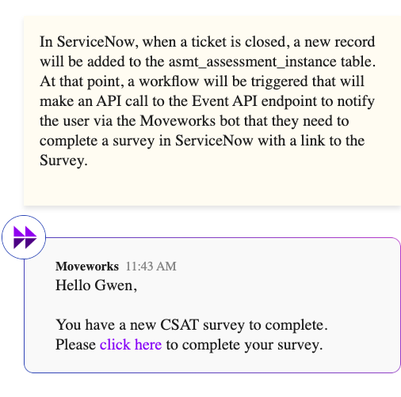
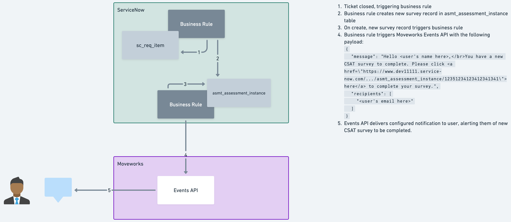
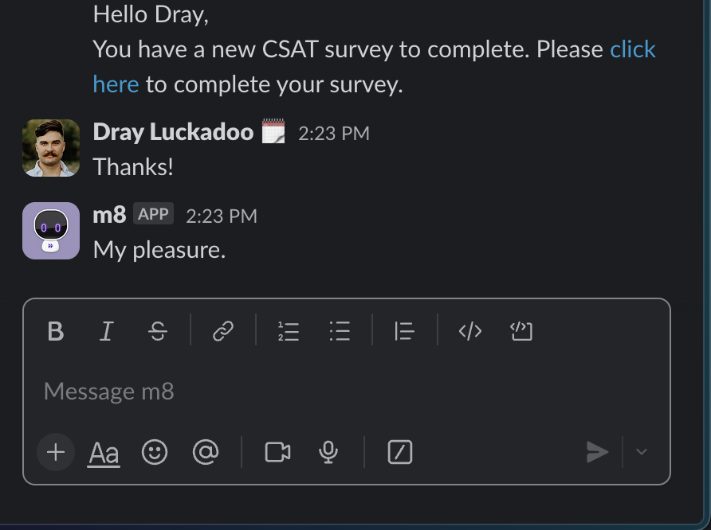

# Introduction

CSAT Surveys are commonly used to gather feedback from end-users on their experience with the IT Service Desk and make UX data-driven decisions. Many organizations use built-in ServiceNow automation to send emails to emails when tickets are resolved, but these are often ignored. Sending out proactive notifications for CSAT surveys directly within chat, often a few seconds after a ticket is resolved, increases the likelihood that a user will provide their feedback.

In this tutorial, we will explore how to use Creator Studio with ServiceNow. 

Let's get started!

# What are we building?

## Conversation Design

[This purple chat](https://developer.moveworks.com/creator-studio/developer-tools/purple-chat-builder/?workspace=%7B%22title%22%3A%22My+Workspace%22%2C%22botSettings%22%3A%7B%22name%22%3A%22Moveworks%22%7D%2C%22mocks%22%3A%5B%7B%22id%22%3A8046%2C%22title%22%3A%22Survey+completion+alert+from+ServiceNow%22%2C%22transcript%22%3A%7B%22settings%22%3A%7B%22colorStyle%22%3A%22LIGHT%22%2C%22startTime%22%3A%2211%3A43+AM%22%2C%22defaultPerson%22%3A%22GWEN%22%2C%22editable%22%3Atrue%2C%22botName%22%3A%22Moveworks%22%7D%2C%22messages%22%3A%5B%7B%22from%22%3A%22ANNOTATION%22%2C%22text%22%3A%22In+ServiceNow%2C+when+a+ticket+is+closed%2C+a+new+record+will+be+added+to+the+asmt_assessment_instance+table.+At+that+point%2C+a+workflow+will+be+triggered+that+will+make+an+API+call+to+the+Event+API+endpoint+to+notify+the+user+via+the+Moveworks+bot+that+they+need+to+complete+a+survey+in+ServiceNow+with+a+link+to+the+Survey.%22%7D%2C%7B%22from%22%3A%22BOT%22%2C%22text%22%3A%22Hello+Gwen%2C%5Cn%5CnYou+have+a+new+CSAT+survey+to+complete.+Please+%3Ca+href%3D%5C%22https%3A%2F%2Fdeveloper.moveworks.com%2Fcreator-studio%2Fconversation-design%2Foverview%2F%5C%22%3Eclick+here%3C%2Fa%3E+to+complete+your+survey.%22%7D%5D%7D%7D%5D%7D) shows the experience we are going to build. [This design pattern](https://developer.moveworks.com/creator-studio/design-patterns/dp-9) also shows the experience.



## Creator Studio Components

✨ **Triggers:** New CSAT record is created in ServiceNow

🤲 **Slots**: N/A 

🏃‍♂️ **Actions:** N/A

📚 **Guidelines:** None

Based on the needs of this use case, we should build an Event.

## API Research

### API #1: Events API

Since we want to integrate with Azure MFA, we should look into their Graph APIs. For this use case, we will need two API calls:



In this context, given that our task primarily focuses on the delivery of automated notifications, the only required tool, in addition to the ITSM platform, is the Events workspace.

To execute this task, an automation in ServiceNow should be established. This automation triggers the Events API when a new 'asmt_assessment_instance' record is created. Subsequently, this action initiates the delivery of a notification to the end user. The notification dispatched to the end user should be appropriately formatted to facilitate optimal comprehensibility and user friendliness.

Ultimately, this configuration wraps up the comprehensive setup required for the automated notification delivery using the Events workspace and the ITSM platform.

The following technical procedure outlines the progression of steps to send automated survey notifications to users:

1. **Ticket Closure Initiates Process**: When a ticket is closed, it triggers a business rule in ServiceNow.
2. **Business Rule Creates New Survey Record**: The activated business rule generates a new survey record within the 'asmt_assessment_instance' table.
3. **Survey Record Triggers Automation**: The creation of a new survey record initiates an automation using the ServiceNow Flow Designer tool.
4. **Flow Designer Engages Moveworks Events API**: The Flow Designer tool activates the Moveworks Events API, which is responsible for delivering the automated notification. The payload for this API trigger will look something like:
    
    ```jsx
    {
      "message": "Hello <user's name here>,</br>You have a new CSAT survey to complete. Please <a href=\"https://www.dev11111.service-now.com/.../asmt_assessment_instance/12351234123412341341\">click here</a> to complete your survey.",
      "recipients": [
        "{{user's email here}}"
      ]
    }
    ```
    
5. **Automated Notification Delivered to User**: Following activating the Events API, the user receives a tailored notification, alerting them to a new Customer Satisfaction (CSAT) survey ready for completion.

The importance of each step in this sequence is to ensure the seamless generation and delivery of CSAT survey notifications to the appropriate end users.

# Steps

## Step 1: Build in Creator Studio

### Setup use case

1. Navigate to the `Events` workspace within Creator Studio
2. Select the `Credentials` tab and click the `Create` button in the top right of the window
    1. Provide a `Credential Name` such as `CSAT Survey Notifications`
    2. Select the `Credential Type` as `API Key` 
    3. Click `Publish` in the bottom right corner of the window
    4. **IMPORTANT:** When the window pops up with the new API key, make sure to copy the key and store it in a secure location as you will be unable to access the key again after closing the window
3. Finally, select the `Events` tab and click the `Create` button in the top right of the window
    1. Provide a `Event Name` such as `CSAT Survey Notifications`
    2. Select `No` as the `Do you want to add follow-up action?` prompt
    3. Ensure the `Show greeting message` check box is set
        1. This will ensure each message starts with `Hi {Recipient's first name}`
    4. Click `Next` in the bottom right corner of the window
    5. **IMPORTANT TO KNOW THAT THERE WILL BE DIFFERENT SELECTIONS WHEN TESTING VS LAUNCHING THE USE CASE**
    6. When launching the use case after testing, set the `Choose a launch option` dropdown to `Launch to all users`
    7. When testing the use case, set the `Choose a launch option` dropdown to a limited option such as `Launch to selected emails` and update the `Allow Emails Values` list with the email addresses of the testers who will receive the notifications
    8. Once you’re ready to launch the use case officially, navigate back to the use case 

## Step 2: Build the ServiceNow flow in Flow Designer

### Implement Functions

1. Open your ServiceNow > Flow Designer.
2. Click New Flow
3. Set the following variables:
    1. TRIGGER
        1. Trigger: Created
        2. Table: Assessment Instance [asmt_assessment_instance]
        3. Condition: State is not Cancelled 
    2. ACTIONS
        1. Add Action > Moveworks Send Message
            1. recipients: Click `+` to add recipient 1
                1. recipient 1: Select `Trigger - Record Created` > `Assessment Instance Record` > `Assigned To` > `email`
                2. message: Any message you want, i.e. `You have a new survey to complete. Please click here to submit your survey`
                3. event_id: Generated in step 1.3

## Step 3: See it in action!

Trigger the use case by asking for it from your Copilot.



Note: It could take a couple minutes before your flow shows up in your copilot. If it doesn’t show up after five minutes, follow our troubleshooting guide to further debug.

# Congratulations!

You just added Survey completion alerts to your Moveworks Copilot! Check out our other guides for inspiration on what to build next.